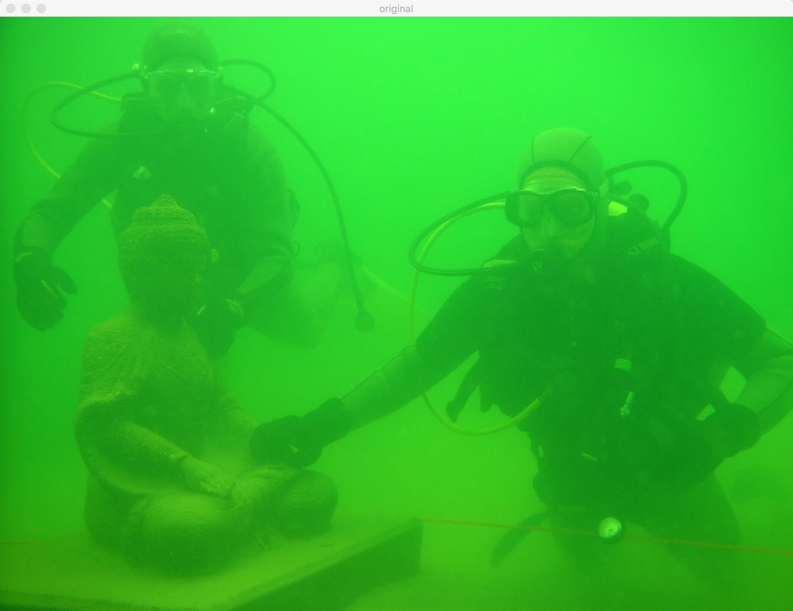

# Aquacolor

Aquacolor is an innovative Android app that enhances your underwater footage by removing the background 
and revealing the vibrant colors. You can also extract stunning images from individual video frames.

Our app prioritizes video quality, ensuring that the original clarity and detail are preserved throughout 
the cleaning process. 

Example inpout | Example Output
--- | ---
 | 
 | 

## Limitations

The converted video has no sound (well, as they are underwater videos I don't think it is a problem ... 
please ping me if you find use cases where this is problematic).

## Contributions

The algorithm that cleans the frames has been implemented at  
[OptimizedImageEnhance](https://github.com/26hzhang/OptimizedImageEnhance).
